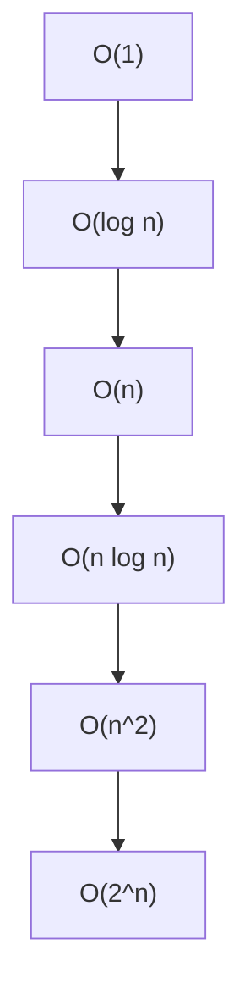

# Test for Mermaid Diagram


```mermaid
graph TD
    A["O(1)"] --> B["O(log n)"]
    B --> C["O(n)"]
    C --> D["O(n log n)"]
    D --> E["O(n^2)"]
    E --> F["O(2^n)"]
```
``````

```mermaid
graph TD
    A["O(1)"] --> B["O(log n)"]
    B --> C["O(n)"]
    C --> D["O(n log n)"]
    D --> E["O(n^2)"]
    E --> F["O(2^n)"]
```
``````
