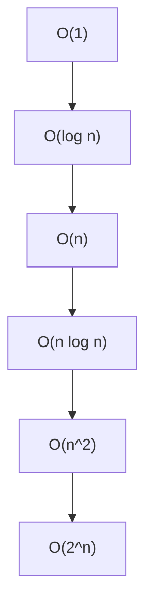
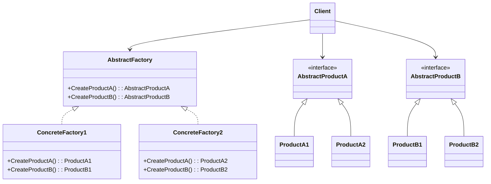

# Test for Mermaid Diagram


```mermaid
graph TD
    A["O(1)"] --> B["O(log n)"]
    B --> C["O(n)"]
    C --> D["O(n log n)"]
    D --> E["O(n^2)"]
    E --> F["O(2^n)"]
```
``````

```mermaid
graph TD
    A["O(1)"] --> B["O(log n)"]
    B --> C["O(n)"]
    C --> D["O(n log n)"]
    D --> E["O(n^2)"]
    E --> F["O(2^n)"]
```
``````


```mermaid
classDiagram
    AbstractFactory <|.. ConcreteFactory1
    AbstractFactory <|.. ConcreteFactory2

    AbstractProductA <|-- ProductA1
    AbstractProductA <|-- ProductA2
    AbstractProductB <|-- ProductB1
    AbstractProductB <|-- ProductB2

    Client --> AbstractFactory
    Client --> AbstractProductA
    Client --> AbstractProductB

    class AbstractFactory {
        +CreateProductA() : AbstractProductA
        +CreateProductB() : AbstractProductB
    }

    class ConcreteFactory1 {
        +CreateProductA() : ProductA1
        +CreateProductB() : ProductB1
    }

    class ConcreteFactory2 {
        +CreateProductA() : ProductA2
        +CreateProductB() : ProductB2
    }

    class AbstractProductA {
        <<interface>>
    }

    class AbstractProductB {
        <<interface>>
    }

    class ProductA1
    class ProductA2
    class ProductB1
    class ProductB2
```
